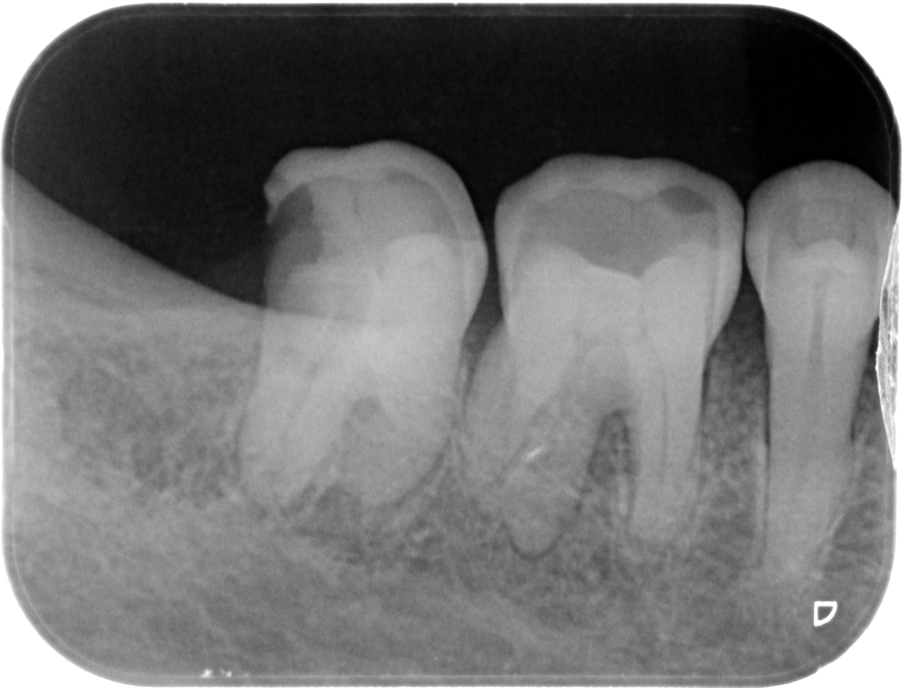
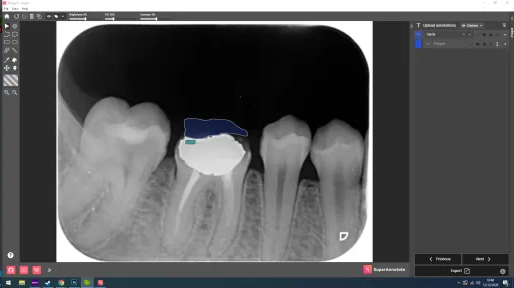
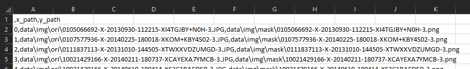
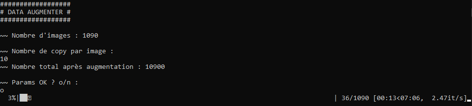
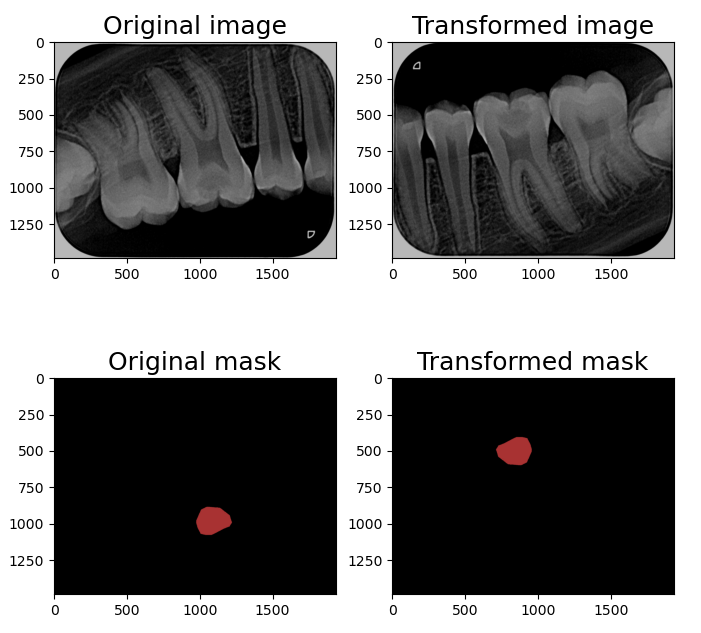
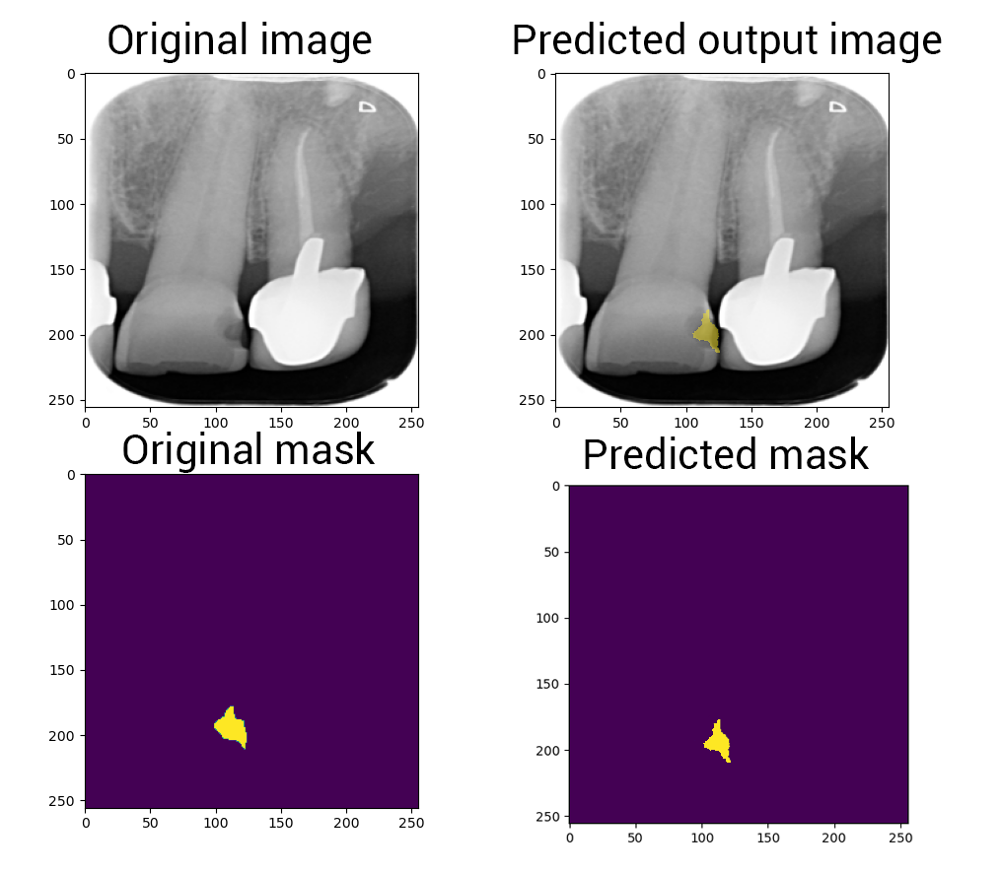

# Tooth Decay Semantic Segmentation

## Description
Logiciel de détection, localisation & segmentation de carries sur des radiographies dentaires.  
  
Basé sur le réseau de neurones U-Net++.  

L'article complet du projet est disponible sur :  
https://deeplylearning.fr/cours-pratiques-deep-learning/segmentation-semantique-dimages/

## Informations

### Dataset original
Les images utilisées sont en noir et blanc (channel=1)
Nous utilisons des images .JPG
Pas besoin d'avoir des tailles spécifiques et identiques dans tout le dataset, car nous utilisons des fulls ConvNet DNN


On organise sous différents groupes :
+ **PM**: pre-molaire
+ **CP**: canine pre-molaire
+ **IC**: incisive canine
+ **I**: implant
+ **E**: enfant
+ **O**: orthodentie

#### Dataset d'entrainement/validation
```json
{
    "TOTAL": {
        "TOTAL": 1100,
        "PM": 725,
        "CP": 151,
        "IC": 160,
        "I": 6,
        "E": 46,
        "O": 12
    },
    "NO_CARRY": {
        "TOTAL": 545,
        "PM": 360,
        "CP": 87,
        "IC": 73,
        "I": 6,
        "E": 7,
        "O": 12
    },
    "CARRY": {
        "TOTAL": 555,
        "PM": 365,
        "CP": 64,
        "IC": 87,
        "I": 0,
        "E": 39,
        "O": 0
    }
}
```
#### Dataset de test
```json
{
    "TOTAL": {
        "TOTAL": 275,
        "PM": 180,
        "CP": 37,
        "IC": 40,
        "I": 3,
        "E": 12,
        "O": 3
    },
    "NO_CARRY": {
        "TOTAL": 148,
        "PM": 87,
        "CP": 27,
        "IC": 27,
        "I": 3,
        "E": 1,
        "O": 3
    },
    "CARRY": {
        "TOTAL": 127,
        "PM": 93,
        "CP": 10,
        "IC": 13,
        "I": 0,
        "E": 11,
        "O": 0
    }
}
```

### Data augmentation

### Annotation
Nous avons utilisé la version gratuite de SuperAnnotate pour labeliser nos données.
Nous traçons pour chaque carrie présente sur une radio un polygone.  


## Installation
Testé seulement sur Python 3.6.12

1. Cloner le répo :  
`$ git clone https://github.com/Momotoculteur/Tooth-decay-semantic-segmentation.git`

2. Installer les modules externes :  
`pip install -r requirements.txt`
   
## Utilisation
### Répo architecture
```
.
├── data                
│   └── img
│        └── mask                 # Mask associé aux radiographies
│        └── ori                  # Radiographie originale
│   └── label           
│        └── annotations.json     # Fichier contenant les annonations des images originale
│        └── classes.json         # Contient la définition des classes
│        └── config.json          # Fichier de configuration de SuperAnnotate
│        └── dataset.csv          # Dataset au format csv
│        └── datasetAugmented.csv # Dataset après augmentation au format csv
├── masksMaker.py                 # Script permettant de générer les masques des images originales a partir du fichier annotations.json
├── datasetLoader.py              # Generateur custom pour charger, transformer et envoyer au DNN
├── datasetAugmenter.py           # Scripts de data augmentation 
├── segmentation_models/..        # Contient divers modèles de réseaux de neurones 
├── train.py                      # Script permettant d'entrainer le réseau
├── utils.py                      # Contient diverses fonction d'aide à l'entrainement/visualization/etc.
```


### Création des masques
Pour chaque image du dataset, nous récupérons les polygones représentant les carries via le fichier annotations.json  
Les masques générés sont format PNG, évitant toute compression et perte de données  
Déplacer vos images originale dans le dossier ./data/img/ori/  
Le dossier ./data/img/mask/ doit être vide à ce stade  
Lancez la création des masques via la commande :
```sh
$ python masksMaker.py
```

Un nouveau fichier va être crée sous ./data/label/dataset.csv. Il contient des couple (X,Y) qui seront consommé pour entrainer notre réseau
de neurones. Il représente votre dataset en format text.  
Pour chaque radiographie lui est associé son masque.  


### Augmentation des données
Requis : les masques des images originales doivent déjà être généré.
Pour garantir de ne pas changer les informations contenues dans les images originales, nous n'utilisons que des déformations non
destructives :
+ Compose
  + OneOf (p=1)
    + VerticalFlip (p=0.2)
    + RandomRotate90 (p=0.2)
    + HorizontalFlip (p=0.2)
  + OneOf (p=1)
    + MotionBlur (p=0.2)
    + MedianBlur (p=0.2)
    + Blur (p=0.2)
    + GaussNoise (p=0.2)
  + OneOf (p=1)
    + RandomBrightnessContrast (p=0.2)
    + CLAHE (p=0.2)
    + RandomGamma (p=0.2)
    + MultiplicativeNoise (p=0.2)

  


Cette étape doit se faire après avoir crée l'ensemble de vos masques. Le dossier ./data/img/ori/ et ./data/img/mask/ doit donc contenir à cet instant là
le même nombre d'élément

Lancer l'étape de dataAug via la commande suivante :
```sh
$ python datasetAugmenter.py
```


### Entrainement
```sh
$ python train.py
```

### Résultats
#### Matrice de confusion
#### ROC curve
#### Métriques

### Prédiction


## Remerciements
```
@article{zhou2019unetplusplus,
  title={UNet++: Redesigning Skip Connections to Exploit Multiscale Features in Image Segmentation},
  author={Zhou, Zongwei and Siddiquee, Md Mahfuzur Rahman and Tajbakhsh, Nima and Liang, Jianming},
  journal={IEEE Transactions on Medical Imaging},
  year={2019},
  publisher={IEEE}
}
@incollection{zhou2018unetplusplus,
  title={Unet++: A Nested U-Net Architecture for Medical Image Segmentation},
  author={Zhou, Zongwei and Siddiquee, Md Mahfuzur Rahman and Tajbakhsh, Nima and Liang, Jianming},
  booktitle={Deep Learning in Medical Image Analysis and Multimodal Learning for Clinical Decision Support},
  pages={3--11},
  year={2018},
  publisher={Springer}
}
@misc{Yakubovskiy:2019,
  Author = {Pavel Yakubovskiy},
  Title = {Segmentation Models},
  Year = {2019},
  Publisher = {GitHub},
  Journal = {GitHub repository},
  Howpublished = {\url{https://github.com/qubvel/segmentation_models}}
}
@misc{ronneberger2015unet,
      title={U-Net: Convolutional Networks for Biomedical Image Segmentation}, 
      author={Olaf Ronneberger and Philipp Fischer and Thomas Brox},
      year={2015},
      eprint={1505.04597},
      archivePrefix={arXiv},
      primaryClass={cs.CV}
}
```

## Licence
Copyright (c) 2021 Bastien MAURICE & Dr.Van-Hoan NGUYEN

This project is licensed under the terms of the MIT [license](LICENSE).
